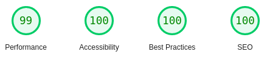

[Visit Site](https://nft-card-preview.vercel.app)


## Getting Started

First, run the development server:

```bash
npm run dev
# or
yarn dev
```

Open [http://localhost:3000](http://localhost:3000) with your browser to see the result.

### Overall Lighthouse Scores :



### Performance metrics :

```yaml
First Contentful Paint: 0.9s
Speed Index: 0.9s
Largest Contentful Paint: 1.0s
Time to Interactive: 2.0s
Total Blocking Time: 70ms
Cumulative Layout Shift: 0
```

### About

---

Let's agree, anyone could've made it within 10 mins (or 5 mins for pros) with basic HTML / CSS but i had plenty of time to spare so i thought "why not perfect it ?".

The project was sturcted taking scalability in mind. So components are structed very well.

**Still there is plenty of room for improvements so feel free to criticize.**
